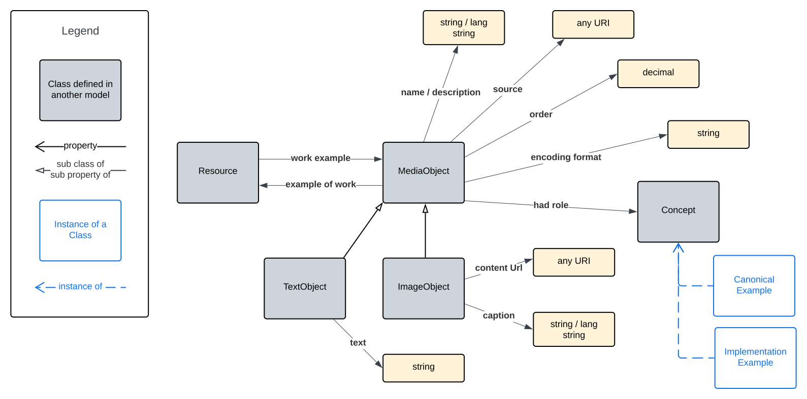

= Exemplification Ontology

[[fig-overview]]
.An informal Model Overview diagram showing the major elements of this model

An ontology for the description of examples.

This ontology mostly reuses existing ontologies' classes and properties for the description of examples, usually examples of model (ontology) elements.

This ontology is published online at:

* *https://linked.data.gov.au/def/exem*

== Rights and License

This ontology was made by https://kurrawong.ai[KurrawongAI] for use in several Australian government projects. The ontology has the following copyright notice:

&copy; KurrawongAI 2023

This information is available for reuse under the https://creativecommons.org/licenses/by/4.0/[Creative Commons 4.0 license], see the LICENSE file for the deed.

Much of the ontology's content is originally published elsewhere and just reused here, as per standard Semantic Web practice. Where elements are reused, their defining source is indicated.

== Contacts

*KurrawongAI* +
info@kurrawong.ai +
https://kurrawong.ai +
